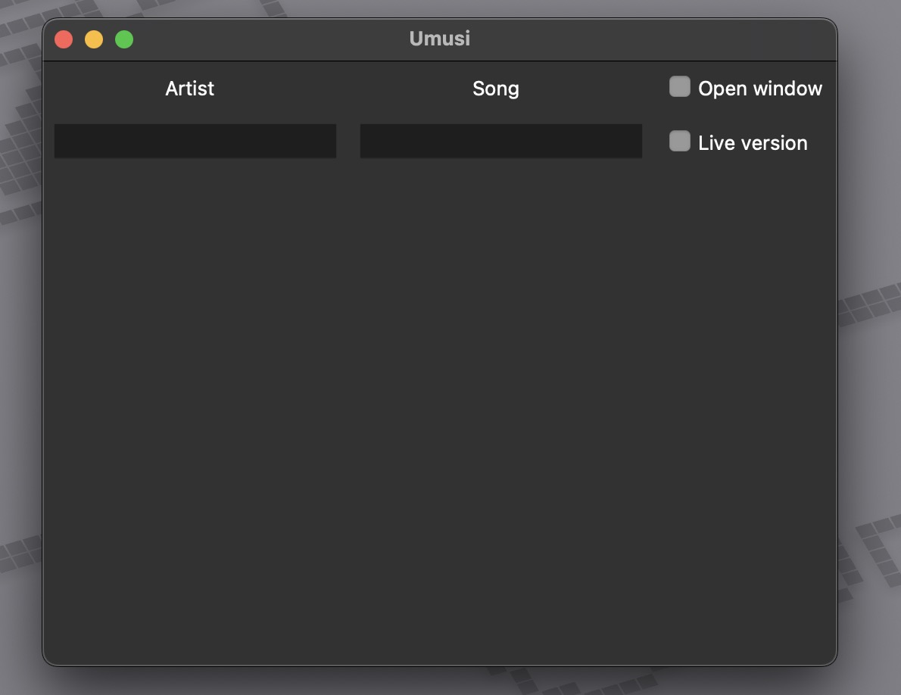
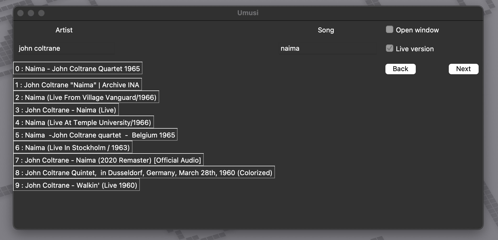

# Umusi

This application opens a small GUI to play music in a headless Selenium browser.

Currently, only Firefox is supported, but more work is coming for Chrome.

Many of the CLI tools out there download the entire mp3 or mp4. The UI is extremely simple and is designed toward more obscure music searches that may not be available on streaming services.

Thank you for checking out Umusi!

## Build

Create a virtual environment and install dependencies.

`make build`

Enter the venv and run the GUI.

`source .venv/bin/activate`

`python3 gui.py`

## Screenshots

